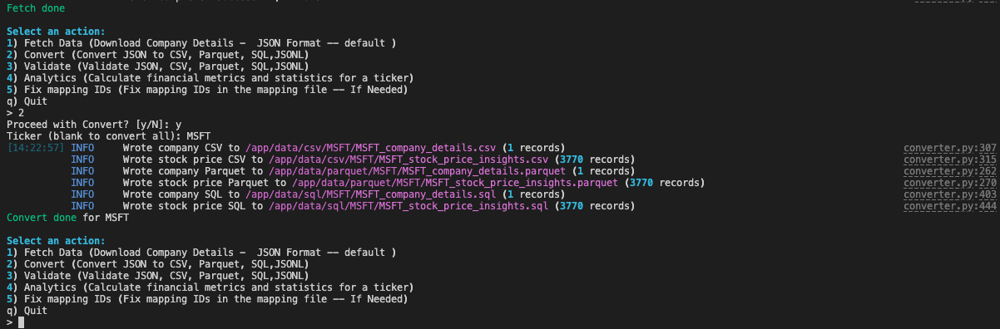
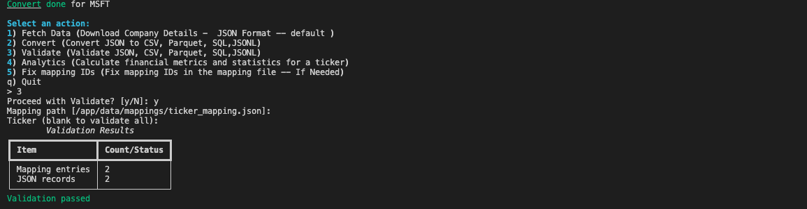
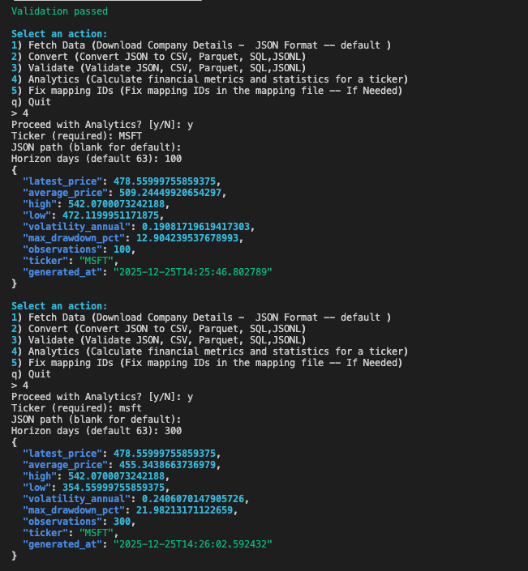
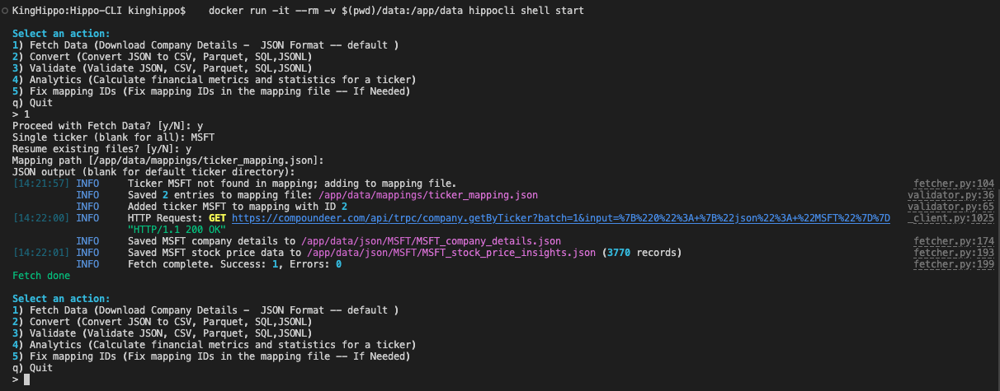
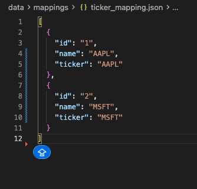
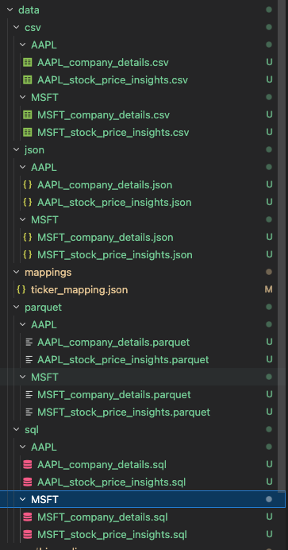

# HippoCLI: Enterprise Financial Data Pipeline

<div align="center">

![HippoCLI]

**A production-grade command-line toolkit for financial data acquisition, transformation, validation, and analytics**

[](https://www.python.org/downloads/)
[](https://opensource.org/licenses/MIT)
[](https://www.python.org/dev/peps/pep-0484/)

</div>

---

## The Story Behind HippoCLI

As a developer with a passion for financial markets, I found myself repeatedly wrestling with fragmented data sources, inconsistent formats, and manual data transformation workflows. What started as a weekend project to automate my personal investment research quickly evolved into a comprehensive data engineering solution.

The challenge was clear: financial data comes in many shapes and sizes—JSON from APIs, CSV for spreadsheets, Parquet for analytics, SQL for databases. Each format serves a different purpose, but manually converting between them was time-consuming and error-prone. More critically, I needed a system that could validate data integrity, handle failures gracefully, and provide actionable analytics—all while maintaining the flexibility to adapt to changing data schemas.

HippoCLI emerged from this need: a battle-tested, production-ready toolkit that transforms raw financial data into structured, validated, multi-format outputs. Built with modern Python best practices, it embodies the principle that great tools should be both powerful and elegant—handling complex data pipelines while remaining simple to use.

---

## Architecture Overview

HippoCLI follows a modular, extensible architecture designed for maintainability and scalability:

### Core Design Principles

- **Separation of Concerns**: Each module handles a distinct responsibility (fetching, validation, conversion, analytics)
- **Type Safety**: Comprehensive type hints using Python 3.9+ typing and Pydantic models
- **Configuration-Driven**: YAML-based configuration with environment variable overrides
- **Error Resilience**: Retry mechanisms with exponential backoff for network operations
- **Format Agnostic**: Unified data model that transforms seamlessly across formats

### System Architecture

```
┌─────────────────────────────────────────────────────────────┐
│                      HippoCLI Core                           │
├─────────────────────────────────────────────────────────────┤
│                                                               │
│  ┌──────────────┐  ┌──────────────┐  ┌──────────────┐      │
│  │   Fetcher    │  │  Validator   │  │  Converter   │      │
│  │              │  │              │  │              │      │
│  │ • HTTP/HTTPS │  │ • Schema     │  │ • JSON       │      │
│  │ • Retry      │  │   Validation │  │ • CSV        │      │
│  │ • Rate Limit │  │ • Data       │  │ • Parquet    │      │
│  │              │  │   Integrity  │  │ • SQL        │      │
│  └──────────────┘  └──────────────┘  └──────────────┘      │
│                                                               │
│  ┌──────────────┐  ┌──────────────┐  ┌──────────────┐      │
│  │  Analytics   │  │   Config     │  │   Models     │      │
│  │              │  │              │  │              │      │
│  │ • Metrics    │  │ • YAML       │  │ • Pydantic   │      │
│  │ • Statistics │  │ • Env Vars  │  │ • Validation │      │
│  │ • Insights   │  │ • Paths     │  │ • Type Safe  │      │
│  └──────────────┘  └──────────────┘  └──────────────┘      │
│                                                               │
└─────────────────────────────────────────────────────────────┘
         │                    │                    │
         ▼                    ▼                    ▼
┌─────────────────────────────────────────────────────────────┐
│                    Data Layer                                │
│  ┌──────────┐  ┌──────────┐  ┌──────────┐  ┌──────────┐  │
│  │   JSON   │  │   CSV    │  │  Parquet  │  │   SQL    │  │
│  └──────────┘  └──────────┘  └──────────┘  └──────────┘  │
└─────────────────────────────────────────────────────────────┘
```

### Data Flow

1. **Ingestion**: Fetcher module retrieves data from external APIs with retry logic and error handling
2. **Validation**: Validator ensures data integrity against Pydantic schemas and business rules
3. **Transformation**: Converter normalizes and flattens nested structures for target formats
4. **Analytics**: Analytics engine computes financial metrics and statistical insights
5. **Output**: Multi-format export (JSON, CSV, Parquet, SQL) with optimized schemas

---

## Technology Stack

### Core Technologies

- **Python 3.9+**: Modern Python with type hints, dataclasses, and pathlib
- **Typer**: Type-safe CLI framework built on Click, leveraging Python type hints
- **Pydantic v2**: Data validation and settings management with runtime type checking
- **Polars**: High-performance DataFrame library for data manipulation (Rust-based)
- **Pandas**: Statistical analysis and time-series operations
- **PyArrow**: Efficient Parquet I/O and columnar data processing

### Infrastructure & Tooling

- **httpx**: Modern async-capable HTTP client with connection pooling
- **Tenacity**: Sophisticated retry logic with exponential backoff
- **Rich**: Beautiful terminal output with tables, progress bars, and syntax highlighting
- **Docker**: Containerized deployment with multi-stage builds
- **pytest**: Comprehensive test suite with coverage reporting

### Development Standards

- **Type Safety**: Full type coverage with mypy strict mode
- **Code Quality**: Ruff for linting, Black for formatting
- **Testing**: pytest with coverage reporting and fixtures
- **Documentation**: Comprehensive docstrings and type annotations

---

## Key Features

### 🔄 Multi-Format Data Conversion

Transform financial data seamlessly across formats optimized for different use cases:

- **JSON**: Human-readable, schema-flexible storage
- **CSV**: Universal compatibility with spreadsheet tools
- **Parquet**: Columnar format for analytics workloads (10-100x compression)
- **SQL**: Ready-to-import database schemas with foreign key relationships



### ✅ Robust Data Validation

Ensure data integrity with multi-layer validation:

- Schema validation using Pydantic models
- Business rule enforcement (ticker format, required fields)
- Mapping file integrity checks
- Cross-reference validation between datasets



### 📊 Advanced Analytics Engine

Compute financial metrics and statistical insights:

- Price volatility calculations (annualized)
- Maximum drawdown analysis
- Rolling window statistics
- Time-series aggregations



### 🚀 High-Performance Data Fetching

Efficient data acquisition with enterprise-grade reliability:

- Automatic retry with exponential backoff
- Resume capability for interrupted operations
- Concurrent request handling
- Rate limiting and timeout management



### 🗺️ Intelligent Ticker Management

Flexible ticker mapping system with auto-discovery:

- JSON-based ticker registry
- Automatic ID assignment and validation
- Support for batch and single-ticker operations
- Mapping file repair utilities



### 📈 Rich Terminal Interface

Beautiful, informative CLI output:

- Color-coded status messages
- Progress indicators for long operations
- Structured data tables
- JSON output formatting



---

## Technical Highlights

### Type-Safe Configuration Management

Leveraging Pydantic Settings for type-safe, validated configuration with multiple sources:

```python
# YAML config → Environment variables → Defaults
# Automatic path resolution and validation
# Docker-aware path detection
```

### Efficient Data Processing

- **Polars** for high-performance DataFrame operations (10-100x faster than Pandas for large datasets)
- **Lazy evaluation** where possible to minimize memory footprint
- **Columnar storage** in Parquet format for optimal analytics performance

### Error Handling & Resilience

- Custom exception hierarchy for precise error handling
- Retry decorators with configurable strategies
- Graceful degradation when optional data is missing
- Comprehensive logging at multiple levels

### Extensibility

- Plugin-ready architecture for custom converters
- Modular design allows easy addition of new formats
- Configuration-driven behavior enables customization without code changes

---

## Installation & Quick Start

### Prerequisites

- Python 3.9 or higher
- pip or poetry for package management

### Installation

```bash
# Clone the repository
git clone https://github.com/TheKingHippopotamus/Hippo-CLI.git
cd Hippo-CLI

# Install dependencies
pip install -r requirements.txt

# Install the package
pip install -e .
```

### Docker Installation

```bash
# Build the image
docker build -t hippocli .

# Run commands
docker run --rm -v $(pwd)/data:/app/data hippocli fetch --ticker AAPL
```

### Basic Usage

```bash
# Fetch data for a single ticker
hippocli fetch --ticker AAPL

# Fetch all tickers from mapping file
hippocli fetch --mapping data/mappings/ticker_mapping.json

# Validate data integrity
hippocli validate

# Convert to all formats
hippocli convert

# Run analytics
hippocli analytics AAPL --horizon 90
```

---

## Project Structure

```
HippoCLI/
├── src/hippocli/          # Core application code
│   ├── cli.py            # Typer CLI command definitions
│   ├── fetcher.py        # HTTP data acquisition
│   ├── converter.py      # Multi-format data transformation
│   ├── validator.py      # Data validation logic
│   ├── analytics.py      # Financial metrics computation
│   ├── config.py         # Configuration management
│   └── models.py         # Pydantic data models
├── config/               # Configuration files
├── tests/                # Test suite
├── static/               # Documentation assets
└── data/                 # Output data directory
```

---

## Performance Characteristics

- **Data Fetching**: ~100-200ms per ticker (network-dependent)
- **CSV Conversion**: ~10-50ms per file (depends on data size)
- **Parquet Conversion**: ~20-100ms per file (with compression)
- **SQL Generation**: ~5-30ms per file
- **Analytics**: ~50-200ms per ticker (depends on data volume)

---

## Best Practices & Design Decisions

### Why Polars + Pandas?

- **Polars**: Primary DataFrame library for data transformation (speed, memory efficiency)
- **Pandas**: Used selectively for time-series operations (mature ecosystem for financial data)

### Why Pydantic v2?

- Runtime type validation catches errors early
- Settings management with multiple source support
- Excellent performance with compiled validators
- Seamless integration with type checkers

### Why Typer over Click?

- Type hints provide automatic CLI argument validation
- Better IDE support and autocomplete
- Reduced boilerplate with decorator-based commands
- Native async support for future enhancements

### Why Separate Stock Price Data?

- Normalized database design (company details vs. time-series data)
- Optimized storage for different access patterns
- Enables efficient querying of historical price data
- Supports future time-series database integration

---

## Future Enhancements

- **Async/Await**: Full async support for concurrent data fetching
- **Database Integration**: Direct export to PostgreSQL, MySQL, SQLite
- **Streaming Processing**: Handle large datasets without loading into memory
- **Custom Analytics**: Plugin system for user-defined metrics
- **API Server**: REST API wrapper for web integration
- **Data Quality Reports**: Automated data quality scoring and reporting

---

## Contributing

This project demonstrates production-ready Python development practices:

- Comprehensive type annotations
- Modular, testable architecture
- Configuration-driven design
- Error handling and logging
- Docker containerization
- Professional documentation

---

## License

MIT License - See LICENSE file for details

---

<div align="center">

**Built with ❤️ by [TheKingHippopotamus](https://github.com/TheKingHippopotamus) for the financial data engineering community**

*Transforming raw data into actionable insights, one ticker at a time.*

</div>

